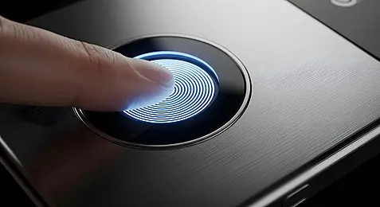
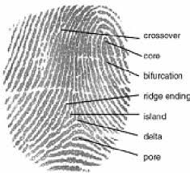
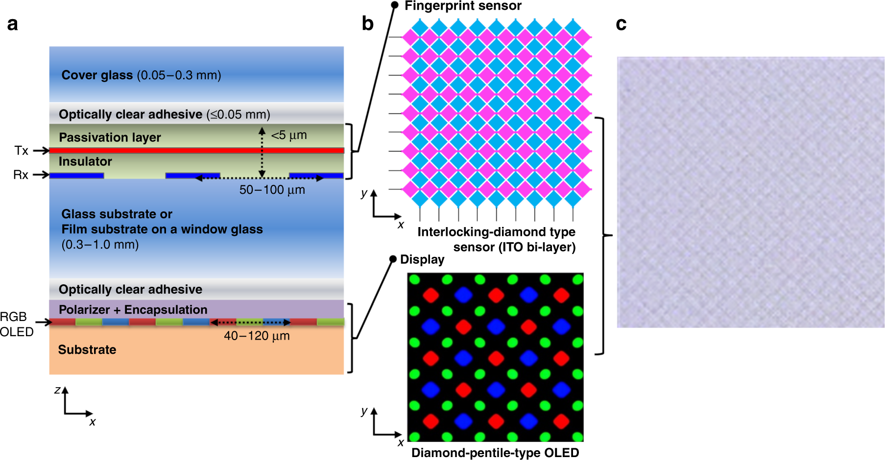
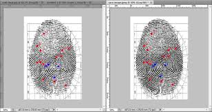
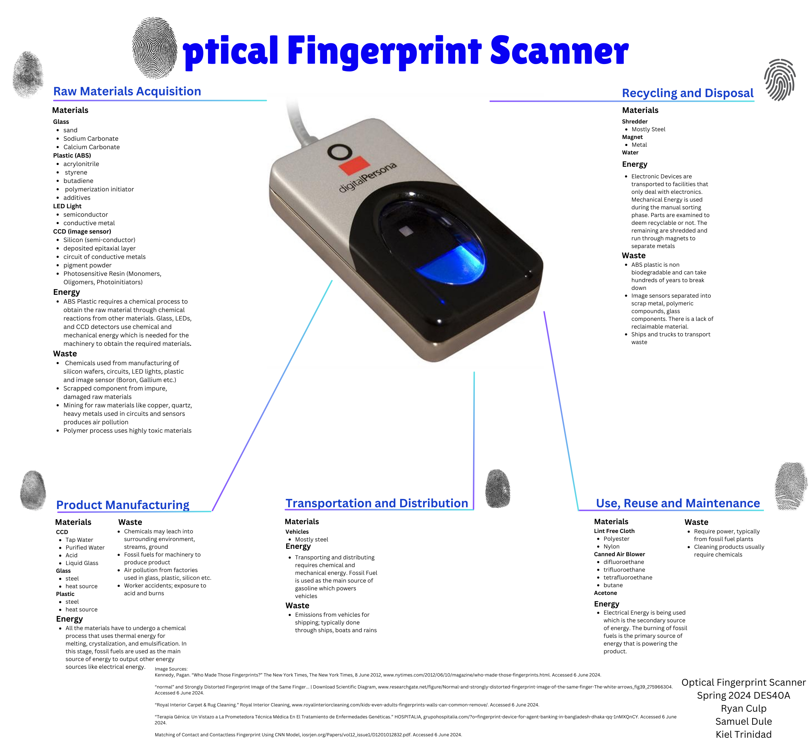
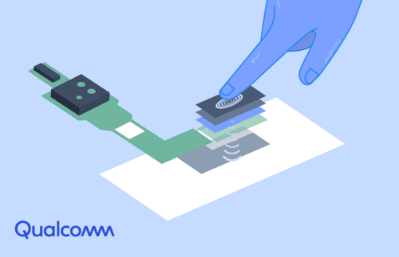
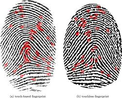
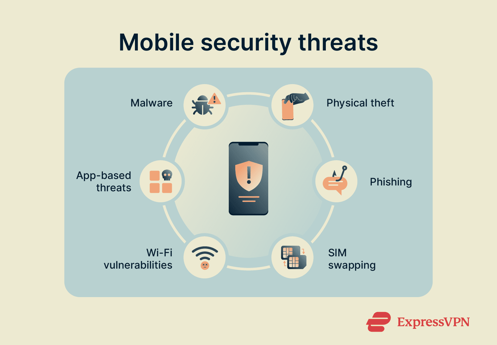

#  How Your Finger Unlocks Your Phone  
### (And Why Your Phone Trusts Your Thumb More Than Your Face)

---

---

##  Let’s Start With Something Weird

You unlock your phone 100 times a day.

Thumb. Tap. Done.

But here’s the crazy part:

 Your phone doesn’t actually *see* your fingerprint.  
 It doesn’t take a proper picture.  
 It doesn’t “know” your finger like you think it does.

Instead…

> Your phone **feels your fingerprint using electricity.**

Yeah. Let that sink in.

---

##  The Big Idea (In One Line)

Your fingerprint sensor is basically:

> **A grid of thousands of tiny capacitors measuring how your finger disturbs an electric field.**

---

##  Imagine Your Finger Like This

Think of your fingerprint as a landscape:

 Ridges → mountains  
 Valleys → gaps  

Now imagine a surface below your finger filled with **tiny sensors**.

Each sensor asks:

> “How close is something to me… electrically?”

---

##  What’s Actually Inside the Sensor?

Under your phone’s surface is:

 A **grid of microscopic capacitors**
 Each one stores tiny electric charge
 Each one reacts differently depending on your fingerprint

---

##  Wait… What is a Capacitor?

A capacitor stores electric charge.

But here’s the important part:

> Its behavior changes depending on what’s near it.

So when your finger touches:

 **Ridges (closer)** → more effect  
 **Valleys (farther)** → less effect  

---

##  What the Sensor Actually “Sees”

Not an image.

Not a photo.

Instead:

 A **map of electrical differences**

Combine thousands of these…

> You get a **digital fingerprint pattern**

---

##  The “Wait, That’s Wild” Moment

Your fingerprint is NOT stored as an image.

It’s stored as:

> **Mathematical data representing electrical variations**

---

##  Step-by-Step: What Happens When You Touch

### 1. You place your finger  
The sensor activates an electric field  

### 2. Capacitors start measuring  
Each tiny cell checks how your finger affects it  

### 3. A pattern is formed  
Ridges vs valleys = different capacitance values  

### 4. Data is processed  
Converted into a digital map  

### 5. Matching happens  
Compared with stored fingerprint  

### 6. Access granted  
Unlocked  or denied  

---

##  Real Talk Moment

Your phone:

> “Face? Could be a photo.”  
> “Password? Could be guessed.”  

Also your phone:

> “Ah yes… your thumb. Welcome back king ”

---

##  Types of Fingerprint Sensors

###  Optical Sensor

 Takes a photo of fingerprint  
 Older technology  

---

###  Capacitive Sensor (Most Used)

 Uses electrical signals  
 Fast and secure  

---

###  Ultrasonic Sensor

 Uses sound waves  
 Works even through glass  

---

##  Why Fake Fingerprints Don’t Easily Work

Because it's not just about shape.

It’s about:

 Electrical properties  
 Conductivity  
 Micro-level interaction  

---

##  Minutiae Points (The Real Identity)

Your phone doesn’t store full fingerprint.

It stores key features called:

> **Minutiae Points**

These include:
 Ridge endings  
 Bifurcations  

This makes matching:
 Faster  
 More secure  

---

##  Where Is Your Fingerprint Stored?

Inside a special secure chip:

 Called Secure Enclave / Trusted Hardware  

Your fingerprint data:
 Never leaves the device  
 Never uploaded to cloud  
 Stored in encrypted form  

---

##  The Engineering Beauty

This is what makes it insane:

 Thousands of sensors working simultaneously  
 Real-time signal processing  
 Pattern recognition in milliseconds  

All happening…

> Every time you casually unlock your phone.

---

##  The Deeper Insight

This is not just fingerprint tech.

This is:

> Human → Electrical Signal → Digital Data → Identity

---

##  Final Thought

Next time you unlock your phone, remember:

Your phone isn’t recognizing your finger.

It’s recognizing…

> The way your finger **disturbs an invisible electric field.**

And honestly?

That’s kinda insane.

---

##  Built For Curiosity

If you made it this far:

You’re exactly the kind of person this was written for.

Not for exams.  
Not for textbooks.  

But for that one moment where you go:

> “Wait… electronics is actually wild.”

---
